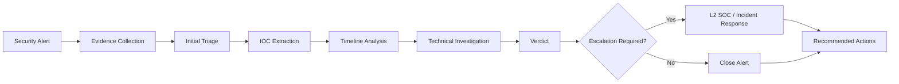

# 🛡️ SOC L1 Incident Investigations

<p align="center">

<strong>Hands-on Security Operations Center (SOC) L1 investigation portfolio</strong>

<br><br>


</p>

---

## 📌 Project Overview

This repository contains a collection of **hands-on SOC L1 incident investigations** designed to simulate real-world security alert triage and investigation workflows.

Each case follows a structured SOC investigation process:

> **Alert → Evidence Collection → Triage → IOC Identification → Timeline → Analysis → Verdict → Escalation → Recommendations**

The investigations cover multiple security domains including:

- 📧 Phishing Email Analysis
- 🌐 Network Traffic Investigation
- 🦠 Malware Sandbox Analysis
- 🔐 Windows Authentication Investigation
- 🖥️ SSH Brute-Force Investigation

All investigations were performed using **synthetic or lab-generated evidence** in a controlled environment.

---

# 🏗️ Investigation Workflow



---

# 🎯 Investigation Objectives

The main objectives of this project are to demonstrate practical SOC L1 capabilities:

- Alert triage
- Evidence preservation
- Log analysis
- Network traffic analysis
- Email header analysis
- IOC extraction
- Authentication analysis
- Timeline construction
- Incident classification
- False-positive identification
- Suspicious activity identification
- Escalation decisions
- SOC documentation
- Incident reporting
- MITRE ATT&CK mapping

---

# 📂 Investigation Cases

| Case | Investigation | Primary Evidence | Verdict |
|---|---|---|---|
| 001 | 📧 Phishing Email | `.eml` email | 🔴 True Positive |
| 002 | 🌐 Wireshark Network Investigation | `.pcap` | 🟠 Suspicious / Inconclusive |
| 003 | 🦠 Malware Sandbox Analysis | Shell sample | 🟠 Suspicious / Inconclusive |
| 004 | 🔐 Windows Authentication Investigation | Security Events | 🟠 Suspicious / Inconclusive |
| 005 | 🖥️ SSH Brute-Force Investigation | `auth.log` | 🟠 Suspicious / Inconclusive |

---

# 🔎 Case 001 — Phishing Email Investigation

### 📧 Alert Type

**Phishing / Credential Harvesting**

### Evidence

- Email message (`.eml`)
- Email headers
- Sender information
- Reply-To information
- Authentication results
- URL analysis
- Source IP

### Key Findings

| Indicator | Observation |
|---|---|
| Sender | `support@micros0ft-security.example` |
| Reply-To | `verify-account@secure-m365-login.example` |
| Source IP | `198.51.100.25` |
| SPF | ❌ Failed |
| DKIM | ❌ Failed |
| DMARC | ❌ Failed |
| URL | `https://micros0ft-security.example/login` |

### Verdict

**🔴 TRUE POSITIVE — PHISHING**

The email demonstrated multiple phishing indicators including sender impersonation, suspicious domains, mismatched Reply-To information, and failed email authentication controls.

### Escalation

**L2 SOC / Incident Response**

### Investigation Artifacts

```text
cases/case-001-phishing/
├── evidence/
│   └── phishing-email.eml
├── notes/
│   ├── triage-notes.md
│   ├── iocs.md
│   └── timeline.md
├── screenshots/
└── incident-report.md
```

---

# 🌐 Case 002 — Wireshark Network Investigation

### Alert Type

**Suspicious Network Traffic**

### Tools

- Wireshark
- PCAP analysis
- DNS analysis
- TCP analysis
- HTTP analysis

### Key Findings

| Indicator | Observation |
|---|---|
| Internal Client | `10.0.0.50` |
| DNS Server | `10.0.0.53` |
| Suspicious Destination | `198.51.100.50` |
| Domain | `update-check.example` |
| Destination Port | `80/TCP` |
| HTTP Request | `/update` |
| HTTP Response | `200 OK` |

### Investigation Flow

```text
DNS Query
    ↓
update-check.example
    ↓
198.51.100.50
    ↓
TCP Connection
    ↓
HTTP GET /update
    ↓
HTTP 200 OK
```

### Verdict

**🟠 SUSPICIOUS ACTIVITY — INCONCLUSIVE**

The traffic showed suspicious DNS resolution and HTTP communication with a suspicious destination. The available synthetic evidence was insufficient to establish confirmed malicious activity.

### Escalation

**L2 SOC / Incident Response**

---

# 🦠 Case 003 — Malware Sandbox Investigation

### Alert Type

**Suspicious File / Malware Analysis**

### Analysis Method

A controlled and safe laboratory sample was executed in a sandbox-style environment to observe its behavior.

### Observed Behavior

- Process execution
- Hostname collection
- Username collection
- Local file creation
- Activity logging
- Successful process termination

### Observed Files

```text
/tmp/lab-updater/activity.log
/tmp/lab-updater/update-complete.txt
```

### Security Observations

| Behavior | Result |
|---|---|
| Process execution | ✅ Observed |
| Host information collection | ✅ Observed |
| File creation | ✅ Observed |
| Network communication | ❌ Not observed |
| Persistence | ❌ Not observed |
| Privilege escalation | ❌ Not observed |
| Credential theft | ❌ Not observed |
| Destructive activity | ❌ Not observed |

### Verdict

**🟠 SUSPICIOUS ACTIVITY — INCONCLUSIVE**

The sample demonstrated system interaction and file creation but did not demonstrate sufficient malicious behavior to classify it as confirmed malware.

### Escalation

**L2 SOC / Incident Response**

> ⚠️ The sample is synthetic and lab-generated. No real malware was used.

---

# 🔐 Case 004 — Windows Authentication Investigation

### Alert Type

**Suspicious Authentication Activity**

### Evidence

Windows Security Event Log data containing:

- Event ID `4625` — Failed Logon
- Event ID `4624` — Successful Logon
- Event ID `4634` — Logoff

### Key Findings

| Account | Activity |
|---|---|
| `jsmith` | Multiple failures followed by success |
| `administrator` | Multiple failures followed by success |
| `backupsvc` | Benign comparison activity |

### Suspicious Source

```text
10.0.0.25
```

### Investigation Pattern

```text
Multiple Failed Logons
        ↓
Successful Authentication
        ↓
Session Activity
        ↓
Investigation Required
```

### Verdict

**🟠 SUSPICIOUS AUTHENTICATION ACTIVITY — INCONCLUSIVE**

The authentication pattern warranted investigation because multiple failed authentication attempts were followed by successful authentication.

The available lab evidence did not establish whether the activity represented legitimate user behavior, password guessing, or compromised credentials.

### Escalation

**L2 SOC / Incident Response**

---

# 🖥️ Case 005 — SSH Brute-Force Investigation

### Alert Type

**SSH Authentication Anomaly**

### Severity

**High**

### Host

```text
LINUX-SERVER-01
```

### Target Account

```text
admin
```

### Suspicious Source

```text
10.0.0.45
```

### Attack Pattern

Seven failed SSH password attempts were observed:

```text
11:20:01  Failed
11:20:04  Failed
11:20:07  Failed
11:20:10  Failed
11:20:13  Failed
11:20:16  Failed
11:20:19  Failed
```

Followed by:

```text
11:20:25  Successful authentication
11:20:26  Session opened
11:25:02  Session closed
```

The successful authentication occurred **6 seconds after the final failed attempt**.

### Investigation Timeline

```mermaid
timeline
    title SSH Authentication Investigation
    11:20:01 : Failed login
    11:20:04 : Failed login
    11:20:07 : Failed login
    11:20:10 : Failed login
    11:20:13 : Failed login
    11:20:16 : Failed login
    11:20:19 : Failed login
    11:20:25 : Successful authentication
    11:20:26 : Session opened
    11:25:02 : Session closed
```

### Verdict

**🟠 SUSPICIOUS SSH AUTHENTICATION ACTIVITY — INCONCLUSIVE**

The sequence of repeated failed password attempts followed shortly by successful authentication is consistent with a potential password-guessing or brute-force scenario.

However, the synthetic evidence does not establish whether the successful authentication was unauthorized.

### Recommended Actions

- Validate whether the `admin` account owner performed the login.
- Review SSH authentication logs for additional activity.
- Investigate source IP `10.0.0.45`.
- Check for additional successful logins.
- Review commands executed during the session.
- Rotate credentials if compromise is confirmed.
- Consider SSH key authentication instead of password authentication.
- Restrict SSH exposure using firewall rules or VPN access.
- Escalate to L2 SOC / Incident Response if unauthorized access is confirmed.

---

# 🧪 Evidence & Investigation Artifacts

Each investigation contains structured SOC documentation.

```text
evidence/
    Raw investigation evidence

notes/
    IOC analysis
    Timeline
    Triage assessment

screenshots/
    Investigation screenshots

incident-report.md
    Final SOC investigation report
```

---

# 📊 SOC Investigation Methodology

Every case follows a consistent L1 SOC workflow.

### 1️⃣ Alert Identification

Determine:

- Alert type
- Affected host
- User/account
- Source IP
- Destination
- Timestamp
- Severity

### 2️⃣ Evidence Collection

Collect relevant:

- Logs
- PCAP files
- Email headers
- Files
- Process information
- Authentication records

### 3️⃣ Triage

Determine whether the activity appears:

- Benign
- Suspicious
- Malicious
- Inconclusive

### 4️⃣ IOC Extraction

Identify:

- IP addresses
- Domains
- URLs
- File hashes
- Usernames
- Hostnames
- Processes
- Files

### 5️⃣ Timeline Construction

Correlate events chronologically to understand the sequence of activity.

### 6️⃣ Technical Analysis

Analyze the evidence using appropriate tools.

### 7️⃣ Verdict

Classify the alert based on available evidence.

### 8️⃣ Escalation

Escalate suspicious or confirmed incidents to:

**L2 SOC / Incident Response**

### 9️⃣ Documentation

Document:

- Findings
- Evidence
- IOCs
- Timeline
- Verdict
- Recommended actions
- Investigation limitations

---

# 🧰 Tools & Technologies

| Category | Tools |
|---|---|
| SOC Analysis | L1 SOC Investigation Workflow |
| Network Analysis | Wireshark |
| Email Analysis | Email Headers / `.eml` |
| Log Analysis | Linux Auth Logs / Windows Security Events |
| Malware Analysis | Controlled Sandbox |
| Documentation | Markdown |
| Version Control | Git / GitHub |
| Operating Systems | Linux / Windows |
| Threat Intelligence Concepts | IOC Analysis |
| Framework | MITRE ATT&CK |

---

# 🧩 MITRE ATT&CK Alignment

The investigations demonstrate concepts associated with several MITRE ATT&CK techniques.

| Technique | ID | Investigation |
|---|---|---|
| Valid Accounts | `T1078` | Authentication Cases |
| Brute Force | `T1110` | SSH Investigation |
| Phishing | `T1566` | Phishing Investigation |
| Command and Scripting Interpreter | `T1059` | Malware Sandbox |
| Network Service | `T1046` | Network Investigation |
| Application Layer Protocol | `T1071` | HTTP Investigation |

> Technique mappings are based on observed or simulated behaviors and are intended for educational/laboratory use.

---

# 📁 Repository Structure

```text
SOC-L1-Incident-Investigations/
│
├── README.md
│
└── cases/
    │
    ├── case-001-phishing/
    │   ├── evidence/
    │   ├── notes/
    │   ├── screenshots/
    │   └── incident-report.md
    │
    ├── case-002-wireshark/
    │   ├── evidence/
    │   ├── notes/
    │   ├── screenshots/
    │   ├── generate_pcap.py
    │   └── incident-report.md
    │
    ├── case-003-malware-sandbox/
    │   ├── sample/
    │   ├── evidence/
    │   ├── notes/
    │   ├── screenshots/
    │   ├── output/
    │   └── incident-report.md
    │
    ├── case-004-windows-event-log/
    │   ├── evidence/
    │   ├── notes/
    │   ├── screenshots/
    │   └── incident-report.md
    │
    └── case-005-ssh-bruteforce/
        ├── evidence/
        ├── notes/
        ├── screenshots/
        ├── output/
        └── incident-report.md
```

---

# 📈 SOC Skills Demonstrated

### Alert Triage

- Alert validation
- Severity assessment
- Initial investigation
- Evidence-based decision making

### Log Analysis

- Windows Security Events
- Linux authentication logs
- Authentication correlation
- Event timeline analysis

### Network Analysis

- DNS investigation
- TCP analysis
- HTTP analysis
- PCAP investigation
- Suspicious destination analysis

### Email Security

- Header analysis
- SPF/DKIM/DMARC interpretation
- Sender validation
- URL analysis
- Phishing identification

### Malware Analysis

- Static observation
- Controlled execution
- Process behavior
- File activity
- IOC extraction

### Incident Response

- Incident classification
- Escalation decisions
- Containment recommendations
- Evidence documentation
- Investigation reporting

---

# 📊 Project Status

| Investigation | Status |
|---|---|
| Case 001 — Phishing | ✅ Completed |
| Case 002 — Wireshark | ✅ Completed |
| Case 003 — Malware Sandbox | ✅ Completed |
| Case 004 — Windows Events | ✅ Completed |
| Case 005 — SSH Brute Force | ✅ Completed |

### Overall Status

**🟢 5/5 SOC L1 investigations completed**

---

# 🚀 Future Improvements

Planned additions include:

- Wazuh SIEM investigations
- Windows Sysmon investigations
- PowerShell threat hunting
- Active Directory attack scenarios
- Credential attack investigations
- Web application attack analysis
- Threat intelligence enrichment
- Sigma detection rules
- YARA-based analysis
- Automated IOC enrichment
- SOAR-style response workflows
- Advanced MITRE ATT&CK mapping

---

# 🎓 Learning Outcomes

This project helped develop practical understanding of:

- SOC L1 alert handling
- Security monitoring
- Log investigation
- Network traffic analysis
- Email security
- Authentication monitoring
- IOC identification
- Incident timelines
- Incident classification
- Escalation procedures
- Security documentation
- Evidence-based investigation

---

# ⚠️ Security & Lab Disclaimer

All evidence in this repository is intended for **educational and portfolio purposes**.

The investigations use:

- Synthetic logs
- Lab-generated network traffic
- Synthetic email data
- Controlled sample behavior
- Documentation/test IP addresses and domains

No real malware or unauthorized systems were intentionally targeted.

---

# 👨‍💻 Author

**Sayan Ghosh**

Cybersecurity Student | Aspiring SOC Analyst

### Areas of Focus

- Security Operations
- SOC L1 Analysis
- Network Security
- Incident Response
- Digital Forensics
- Cloud Security
- Threat Detection

---

# ⭐ Project Highlights

```text
5 SOC L1 Investigation Cases
        ↓
Multiple Evidence Types
        ↓
IOC Extraction
        ↓
Timeline Analysis
        ↓
Technical Investigation
        ↓
Evidence-Based Verdict
        ↓
L2 Escalation Decisions
        ↓
Professional Incident Documentation
```

---

# 📌 Project Summary

This repository demonstrates a practical approach to **SOC L1 alert triage and incident investigation** using realistic security scenarios and structured investigation methodology.

Rather than focusing only on theoretical cybersecurity concepts, the project demonstrates the complete investigation lifecycle:

> **Detect → Triage → Investigate → Correlate → Classify → Escalate → Document**

The goal is to demonstrate practical SOC analyst skills through reproducible laboratory investigations.

---

<p align="center">

### 🛡️ SOC L1 Investigation Portfolio

<strong>Detect • Investigate • Analyze • Escalate • Document</strong>

</p>
